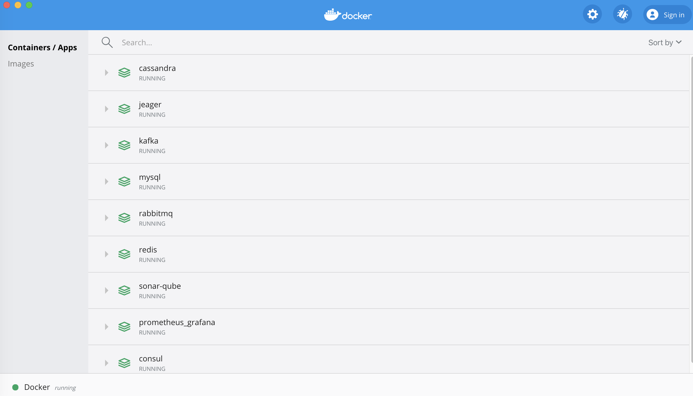

## Usage

- Go into directories of infrastructure

Example:
```shell script
cd mysql
```

- Start service

```shell script
docker-compose up -d
```

- Stop service

```shell script
docker-compose down
```


- Stop all container

```shell script
docker container stop $(docker container ls -aq)
```

<div align="center">
    
</div>

## Reference
- https://github.com/jonatan-ivanov/local-services